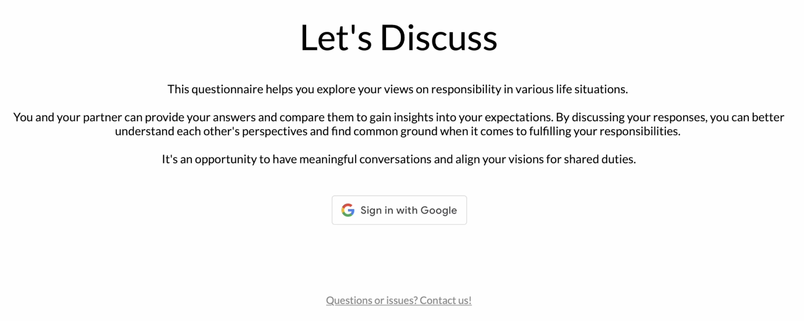
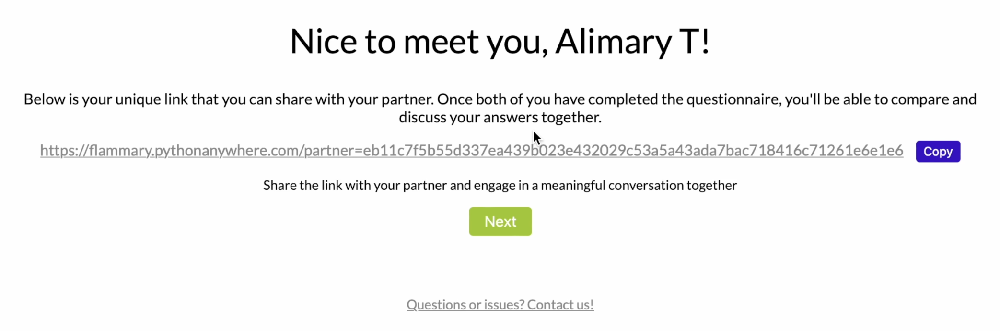
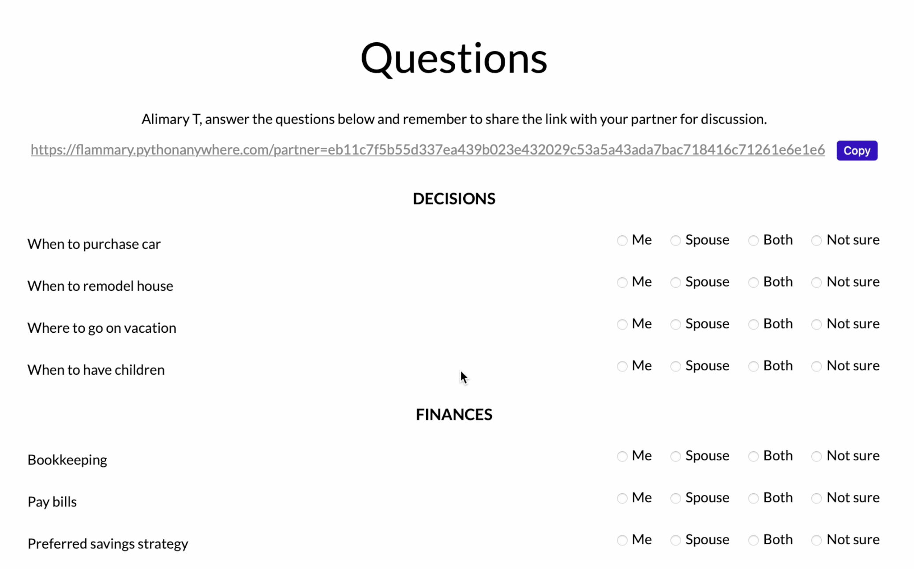
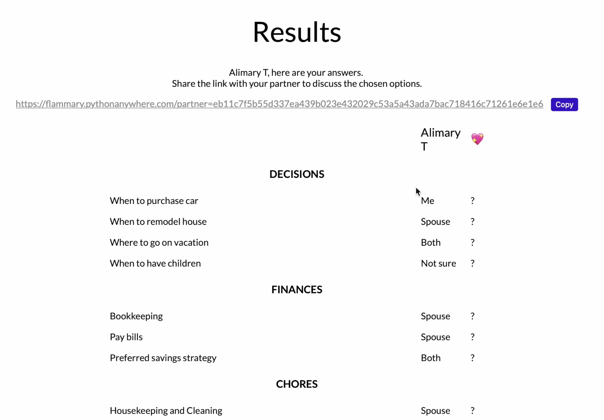
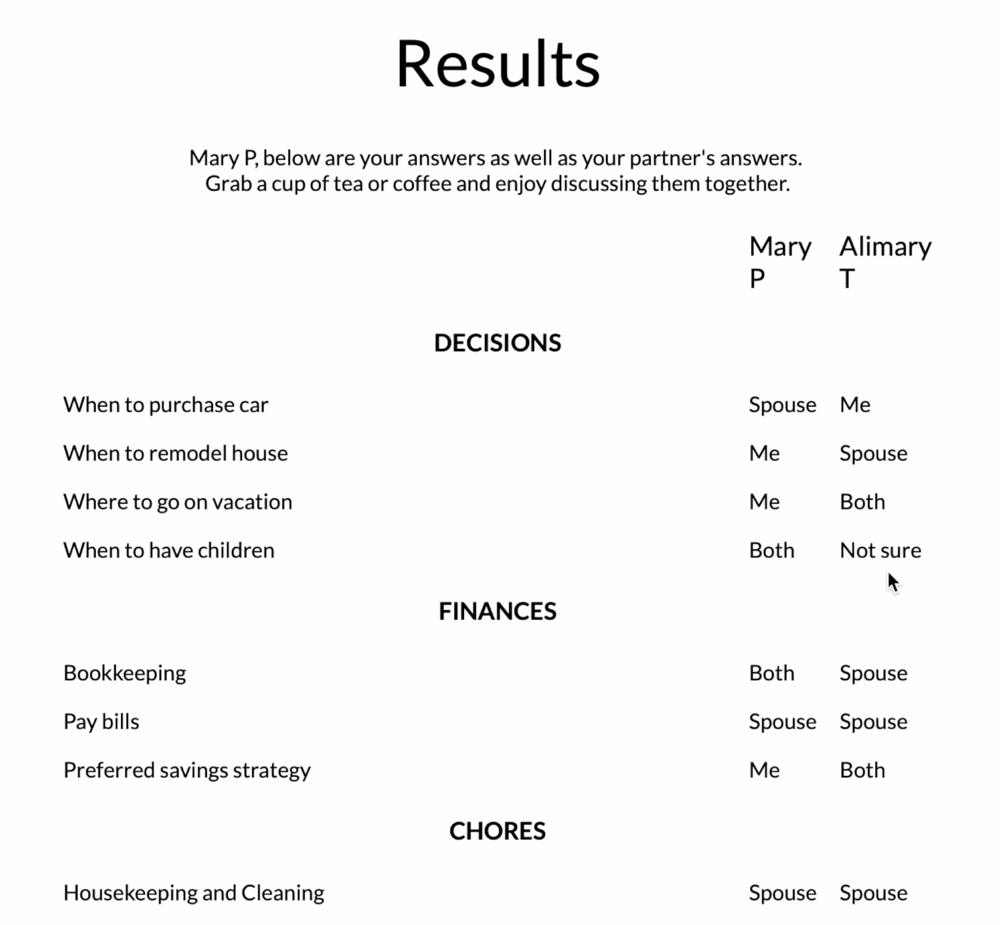

# LetsDiscuss

#### Video Demo:  https://youtu.be/kmfX0q0yGck

#### Description:
**Let's Discuss** is an engaging and interactive couples questionnaire designed to enhance relationship communication and decision-making. 

This web-based platform provides thought-provoking questions and scenarios covering various aspects of life, such as decision-making, finances, shared interests, and more. By exploring these topics together, couples can deepen their understanding, strengthen their bond, and navigate important decisions as a team. 


## Tech details
```
Python, Flask, Jinja2, Javascript, Google Auth, HTML, CSS, SQLite
```
### Backend
- api.py _- backend part with navigation between pages and managing secure information like JWT-token_

### Frontend
- auth.js _- methods for Google authorization_
- partner_link.js _- common UI element with generated partner link for some pages_

Pages
- layout.html _- common UI for every page_
- index.html _- main page_



- partner_link.html _- page describing partner link mechanic_



- questions.html _- question page_



- results.html _- user and user's partner answers_



- styles.css

### Database
 SQLite database **questionnaire.db** with tables
- users (id, name, hash, partner_id)
- sections (id, text, page_order) _- question sections_
- questions (id, text, section_id)
- options (id, text) _- question options_
- results (user_id, question_id, option_id)

### Other
- helpers.py - utility methods
- models.py - application entities like User, Question, Optin, etc 
